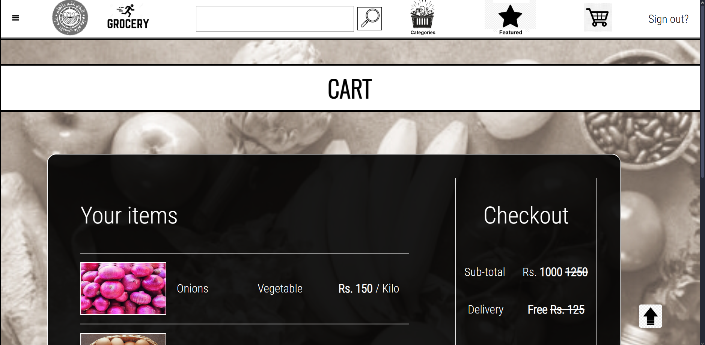

# 🛒 GroceryHub - E-Commerce Website

A modern, responsive e-commerce website for grocery shopping with an intuitive user interface and seamless shopping experience.



## ✨ Features

- **User-friendly Interface**: Clean and intuitive design for easy navigation
- **Product Categories**: Browse products by categories (Fruits & Vegetables, Essentials, etc.)
- **Featured Products**: Discover highlighted products and special offers
- **Shopping Cart**: Add and manage items in your cart
- **Responsive Design**: Works on desktop and mobile devices

## 🛠️ Technologies Used

- HTML5
- CSS3
- JavaScript (Vanilla)
- Responsive Design Principles


## 🏁 Getting Started

### Prerequisites

- Any modern web browser (Chrome, Firefox, Safari, Edge)

### Installation

1. Clone the repository:
   ```bash
   git clone https://github.com/yourusername/groceryhub.git
   ```

2. Open `index.html` in your browser to view the website


## 👥 Contributors

- **M. Ibrahim Kiani** - *Team Lead & Developer*
- **Eman Ali** - *Developer*
- **Haider Farooq** - *Developer*
- **Sanaullah Farooqi** - *Developer*

## 👨‍🏫 Supervisor

- **Madam Khizra Sohail**
